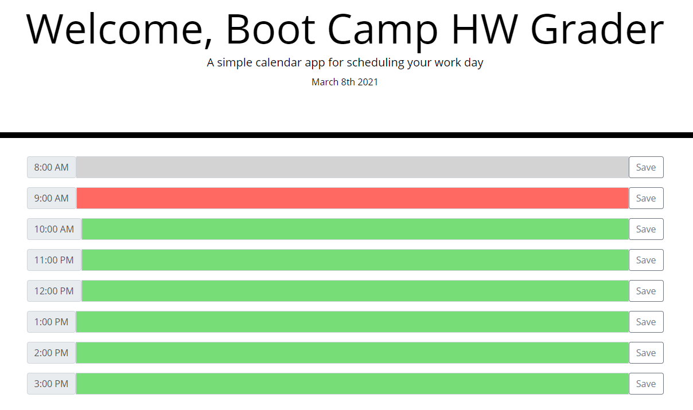

# Day Planner

Here is a simple and not so unique way of scheduling and saving your day. Enter your events in the text box and smash that save button for the website to remember it for you. 

## Project Links

[GitHub Repository](https://github.com/JosephCordell/DayPlanner)

[Webpage](https://josephcordell.github.io/DayPlanner/)

## Screenshot of webpage

## Features
- A date that tells you what day it is
- The ability to save your schedule and go back to it later
- Color coded events based on time. Future events are green, current events are red, past events are gray

## What I learned

- Bootstrap
- A little bit of jQuery